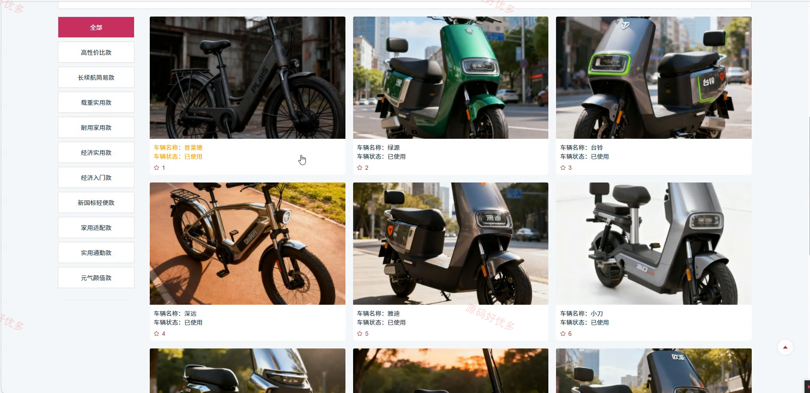
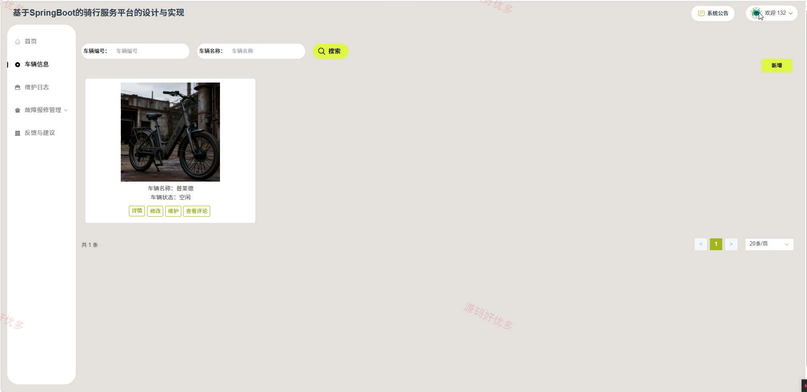
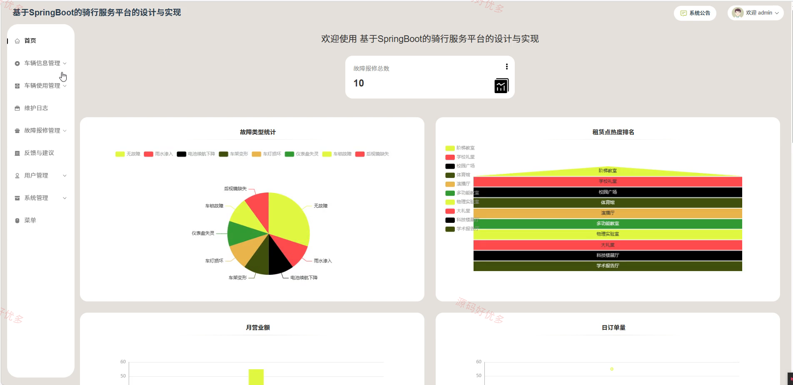
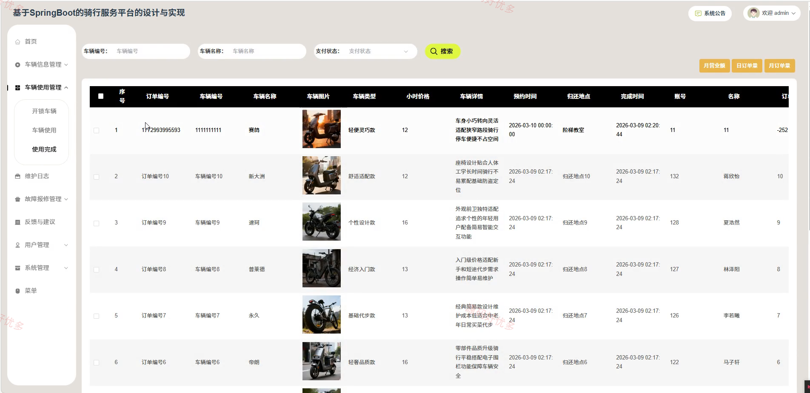

## 源码问题查看主页咨询

### 一、关键词
骑行服务平台、骑行服务、骑行服务预约、骑行服务管理

### 二、作品包含
源码+数据库+万字设计文档+PPT+全套环境和工具资源+本地部署教程

### 三、项目技术
前端技术： Html、Css、Js、Vue3.5、Element-Plus
后端技术：Java、SpringBoot3.3.0、MyBatis-Plus

### 四、运行环境（以下版本亲测，其他版本兼容性请自行测试）
开发工具：IDEA/eclipse + VSCODE

数据库：MySQL8.0+（共23张表）

数据库管理工具：Navicat10以上版本

环境配置软件： JDK17 + Maven3.6.3

前端Nodejs：16+

浏览器：谷歌浏览器

### 五、项目介绍
项目编号：springbootA692D

骑行服务平台面向用户、运维人员、管理员，提供资讯查看、车辆信息查看、车辆信息开锁、车辆信息查看评论、开锁车辆查看、开锁车辆使用、车辆使用查看等功能，实现各角色在系统中的实际业务协作。

角色：用户、运维人员、管理员

用户功能：登录注册与个人中心维护、资讯浏览、车辆信息浏览开锁评价收藏、开锁车辆使用、车辆使用关锁、使用完成支付评价、故障报修及进度查看、反馈与建议提交。

运维人员功能：后台登录注册、车辆信息维护、维护日志查看、故障报修统计、故障报修处理、报修处理查看、反馈与建议查看。

管理员功能：后台登录、车辆信息与分类区域管理、骑行使用与完成订单管理、故障报修与处理管理、维护日志管理、用户与运维人员管理、反馈建议与资讯管理、系统配置菜单及日志管理。

### 六、运行截图

